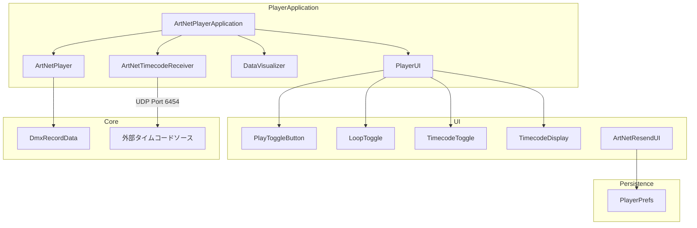
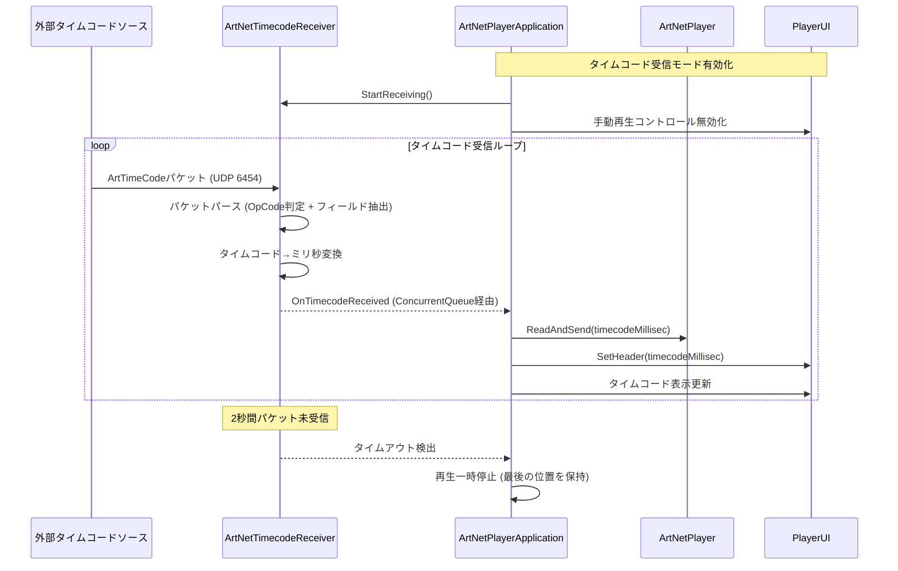
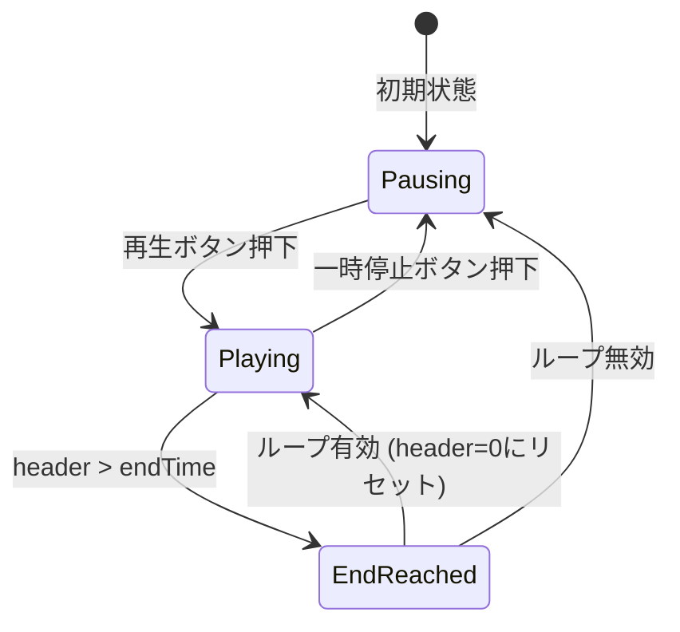
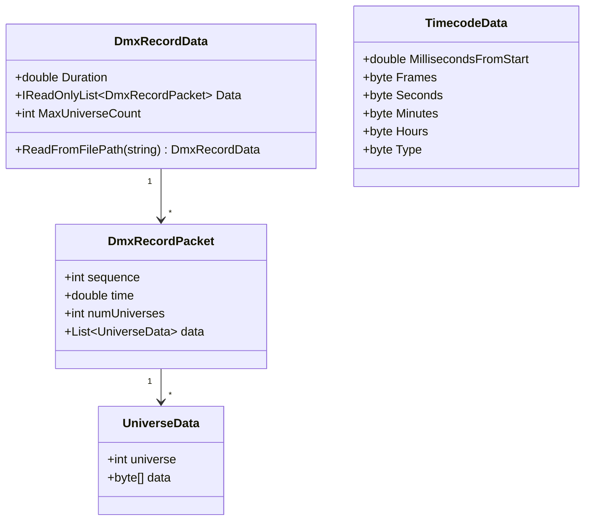

# 技術設計書: playback-enhancements

## 概要

**目的**: 本機能は、ArtNet / UDP Recorderのプレーヤー機能における品質改善と機能拡張を提供する。シークバーの性能問題を修正し、ループ再生・タイムコード同期再生・設定値の永続化を追加することで、照明エンジニアが大規模なDMXデータを効率的に扱えるようにする。

**ユーザー**: 照明エンジニアが、録画データのプレビュー・タイミング確認・デモ再生・外部機器との同期再生のワークフローで利用する。

**影響**: 既存の `ArtNetPlayer`、`ArtNetPlayerApplication`、`PlayerUI`、`ArtNetResendUI` クラスを拡張し、`DmxRecordData` のデータ取得効率を改善する。新規クラスとして `ArtNetTimecodeReceiver` を追加する。

### ゴール
- 32ユニバース以上の録画データでシークバーが正常動作すること
- ループ再生によりデータの繰り返し再生が可能であること
- ArtNet Timecodeパケットによる外部同期再生が実現すること
- DstIP / DstPort / トグル状態がアプリケーション再起動後も保持されること

### 非ゴール
- 録画データのバイナリ形式の変更（ヘッダーへのユニバース数フィールド追加は今回のスコープ外）
- sACN / 生UDPプロトコルのタイムコード対応
- タイムコードの送信機能
- DstIP / DstPortのプリセット管理やエクスポート機能

## アーキテクチャ

### 既存アーキテクチャ分析

現在のプレーヤー機能は以下の構造で動作する:

- `ArtNetPlayerApplication` がプレーヤーのライフサイクルを管理し、`Update()` ループで再生ヘッダーを進行させる
- `ArtNetPlayer` がDMXデータの読み込み・探索・ArtNet再送信を担当する
- `PlayerUI` がスライダー（シークバー）と再生/一時停止ボタンのUIを提供する
- `ArtNetResendUI` がArtNet再送信先のIP・ポート入力を管理する
- `DataVisualizer` がComputeShaderでDMXデータを可視化する

**既存の技術的問題**:
- `ArtNetPlayerApplication` の `maxUniverseNum` が `const int 32` にハードコードされており、録画データの実際のユニバース数を反映しない
- `ArtNetPlayer.ReadAndSend()` が全パケットに対する線形探索を行うため、パケット数に比例してフレームごとの処理コストが増大する
- `ArtNetResendUI` にデータの永続化機構が存在しない

### アーキテクチャパターン & 境界マップ



**アーキテクチャ統合**:
- 選択パターン: 既存のMonoBehaviourコンポーネント指向パターンを維持し、新機能を拡張として追加
- 境界分離: タイムコード受信は独立した `ArtNetTimecodeReceiver` コンポーネントとして分離し、`ArtNetPlayer` の既存責務と混在させない
- 既存パターン維持: UniRxによるリアクティブイベント接続、バックグラウンドスレッドでのUDP受信、`ConcurrentQueue` によるスレッド間通信
- 新規コンポーネント根拠: `ArtNetTimecodeReceiver` はUDP受信ループとプロトコルパースという独立した責務を持つため、`ArtNetPlayer` とは別コンポーネントとする
- Steering準拠: UI層とロジック層の分離、リアクティブ接続、スレッド安全性の原則を遵守

### 技術スタック

| レイヤー | 選択 / バージョン | 本機能での役割 | 備考 |
|---------|------------------|---------------|------|
| エンジン | Unity 2022.1.14f1 | ランタイム環境 | 変更なし |
| 言語 | C# | 全実装 | 既存のunsafeコードパターンを維持 |
| リアクティブ | UniRx | UI-ロジック間イベント接続 | ループ/タイムコードトグルのイベント接続に使用 |
| 非同期 | UniTask / Task.Run | タイムコードUDP受信ループ | 既存のバックグラウンドスレッドパターンを踏襲 |
| 永続化 | PlayerPrefs | DstIP/DstPort/トグル状態の保存 | 新規依存なし。Unity標準API |
| ネットワーク | System.Net.Sockets.UdpClient | タイムコードパケット受信 | 既存のUDP受信パターンを踏襲 |

## システムフロー

### タイムコード受信・同期再生フロー



### ループ再生フロー



## 要件トレーサビリティ

| 要件 | 概要 | コンポーネント | インターフェース | フロー |
|------|------|--------------|----------------|--------|
| 1.1 | 32ユニバース以上でシーク操作を受付 | DmxRecordData, ArtNetPlayer, ArtNetPlayerApplication | Initialize(maxUniverse) | - |
| 1.2 | シークバードラッグでDMX取得・ビジュアライザー更新 | ArtNetPlayer | ReadAndSend(header) | - |
| 1.3 | 再生中のフレームレート低下なくシークバー更新 | ArtNetPlayer | FindPacketIndex(header) | - |
| 1.4 | 実ユニバース数に基づくバッファ初期化 | DmxRecordData, ArtNetPlayerApplication | MaxUniverseCount プロパティ | - |
| 2.1 | ループトグルボタン提供 | PlayerUI | OnLoopToggleChanged | - |
| 2.2 | ループ有効時の先頭リセット自動再生 | ArtNetPlayerApplication | - | ループ再生フロー |
| 2.3 | ループ無効時の終端停止 | ArtNetPlayerApplication | - | ループ再生フロー |
| 2.4 | 再生中のループ設定即時反映 | ArtNetPlayerApplication | isLoopEnabled フラグ | - |
| 3.1 | タイムコード受信モードUI | PlayerUI | OnTimecodeToggleChanged | - |
| 3.2 | タイムコード値に対応した再生位置シーク | ArtNetTimecodeReceiver, ArtNetPlayerApplication | OnTimecodeReceived | タイムコード受信フロー |
| 3.3 | タイムコードモード中の手動再生無効化 | ArtNetPlayerApplication, PlayerUI | SetManualControlEnabled(bool) | - |
| 3.4 | タイムコード値のリアルタイム表示 | PlayerUI | SetTimecodeDisplay(string) | - |
| 3.5 | タイムコード未受信時の一時停止 | ArtNetTimecodeReceiver, ArtNetPlayerApplication | タイムアウト検出 | タイムコード受信フロー |
| 3.6 | タイムコードモード解除時の手動制御復元 | ArtNetPlayerApplication, PlayerUI | SetManualControlEnabled(bool) | - |
| 4.1 | DstIP入力値の保存 | ArtNetResendUI | PlayerPrefs | - |
| 4.2 | DstPort入力値の保存 | ArtNetResendUI | PlayerPrefs | - |
| 4.3 | 起動時の保存値読み込み・表示 | ArtNetResendUI | PlayerPrefs | - |
| 4.4 | 保存データ未存在時のデフォルト値表示 | ArtNetResendUI | PlayerPrefs | - |
| 4.5 | トグル状態の保存 | ArtNetResendUI | PlayerPrefs | - |

## コンポーネントとインターフェース

| コンポーネント | ドメイン/レイヤー | 意図 | 要件カバレッジ | 主要依存 (P0/P1) | コントラクト |
|--------------|-----------------|------|--------------|-----------------|-------------|
| DmxRecordData | Core/DataStructure | 録画データの読み込みとユニバース数の動的検出 | 1.1, 1.4 | なし | Service |
| ArtNetPlayer | Core/Player | DMXデータ探索の最適化と再送信 | 1.1, 1.2, 1.3, 1.4 | DmxRecordData (P0), ArtNetResendUI (P1) | Service |
| ArtNetTimecodeReceiver | Core/Player | ArtNet Timecodeパケットの受信とパース | 3.2, 3.5 | なし | Service, Event |
| ArtNetPlayerApplication | Core/Application | 再生ライフサイクル管理、ループ・タイムコード統合 | 1.1, 1.4, 2.2, 2.3, 2.4, 3.2, 3.3, 3.5, 3.6 | ArtNetPlayer (P0), PlayerUI (P0), ArtNetTimecodeReceiver (P1) | State |
| PlayerUI | UI | ループ/タイムコードUIコントロール | 2.1, 3.1, 3.3, 3.4, 3.6 | PlayToggleButton (P1) | Service |
| ArtNetResendUI | UI | 再送信設定の永続化 | 4.1, 4.2, 4.3, 4.4, 4.5 | PlayerPrefs (P0) | State |
| ArtNetOpCodes | Core/ArtNet | OpCode定義にTimecodeを追加 | 3.2 | なし | - |

### Core / DataStructure

#### DmxRecordData

| フィールド | 詳細 |
|-----------|------|
| 意図 | 録画データの読み込み時に最大ユニバース番号を検出し公開する |
| 要件 | 1.1, 1.4 |

**責務 & 制約**
- ファイル読み込み時に全パケットを走査し、出現する最大ユニバース番号+1を `MaxUniverseCount` として記録する
- 既存の `ReadFromFilePath` メソッドの走査ループ内で最大値を計算するため、追加I/Oコストは発生しない
- パケットリストは時間順ソート済みの不変リストとして保持する

**依存**
- なし（純粋なデータ構造）

**コントラクト**: Service [x] / API [ ] / Event [ ] / Batch [ ] / State [ ]

##### サービスインターフェース
```csharp
public class DmxRecordData
{
    // 既存
    public double Duration { get; }
    public IReadOnlyList<DmxRecordPacket> Data { get; }

    // 新規: 録画データに含まれるユニバースの最大数 (最大ユニバース番号+1)
    public int MaxUniverseCount { get; }

    public static DmxRecordData ReadFromFilePath(string path);
}
```
- 前提条件: `path` が有効な .dmx ファイルパスであること
- 事後条件: `MaxUniverseCount >= 1`、`Data` は時間順にソートされた読み取り専用リスト
- 不変条件: `Data` の各パケットの `time` フィールドは単調非減少

**実装ノート**
- 統合: `Data` プロパティの型を `IEnumerable<DmxRecordPacket>` から `IReadOnlyList<DmxRecordPacket>` に変更し、インデックスアクセスと二分探索を可能にする
- バリデーション: `MaxUniverseCount` が0の場合は最低1を設定する
- リスク: 既存コードが `IEnumerable` に依存している箇所がある場合の互換性。`IReadOnlyList` は `IEnumerable` を実装するため後方互換

### Core / Player

#### ArtNetPlayer

| フィールド | 詳細 |
|-----------|------|
| 意図 | 指定タイムスタンプのDMXデータを効率的に探索し、ArtNet再送信を行う |
| 要件 | 1.1, 1.2, 1.3, 1.4 |

**責務 & 制約**
- 二分探索による高速なパケット探索を提供する
- バッファサイズを `DmxRecordData.MaxUniverseCount` に基づいて動的に初期化する
- ユニバース番号に対する境界チェックを行い、範囲外データを無視する

**依存**
- Inbound: ArtNetPlayerApplication — 再生ヘッダー値の提供 (P0)
- Outbound: ArtNetResendUI — 再送信先情報の参照 (P1)
- Outbound: DmxRecordData — 録画データの参照 (P0)

**コントラクト**: Service [x] / API [ ] / Event [ ] / Batch [ ] / State [ ]

##### サービスインターフェース
```csharp
public class ArtNetPlayer : MonoBehaviour
{
    // 既存 (変更なし)
    public UniTask<DmxRecordData> Load(string path);
    public double GetDuration();

    // 変更: maxUniverseNumをDmxRecordData.MaxUniverseCountから取得する前提
    public void Initialize(int maxUniverseNum);

    // 変更: 二分探索ベースの実装に最適化
    public float[] ReadAndSend(double header);
}
```
- 前提条件: `Initialize()` が呼び出し済みであること。`header` は 0 以上 Duration 以下
- 事後条件: 返却される `float[]` のサイズは `maxUniverseNum * 512`
- 不変条件: `dmx` バッファのサイズは `maxUniverseNum` と一致

**実装ノート**
- 統合: `ReadAndSend` 内部で `List<T>.BinarySearch` または手動二分探索を使用し、線形探索 O(n) を O(log n) に改善する。連続再生時は前回のインデックスから前方探索するキャッシュ最適化を併用する
- バリデーション: `universeData.universe` がバッファサイズ未満であることをチェックし、範囲外データをスキップする
- リスク: 既存の`ReadAndSend`の挙動変更により、同一ヘッダー値での返却データが微妙に異なる可能性（ただし、最も近いパケットを返す動作は同等）

#### ArtNetTimecodeReceiver

| フィールド | 詳細 |
|-----------|------|
| 意図 | ArtNet Timecodeパケットをバックグラウンドスレッドで受信し、タイムコード値をメインスレッドに通知する |
| 要件 | 3.2, 3.5 |

**責務 & 制約**
- ポート6454でUDPパケットを受信し、OpCode 0x9700 (OpTimeCode) を検出してパースする
- `ConcurrentQueue` 経由でメインスレッドにタイムコードデータを受け渡す
- タイムアウト検出（最終受信から2秒経過）を行い、タイムアウトフラグを公開する
- レコーダーとポートを排他利用するため、`StartReceiving` / `StopReceiving` で明示的にソケットのライフサイクルを管理する

**依存**
- Inbound: ArtNetPlayerApplication — 開始/停止の制御 (P0)
- External: System.Net.Sockets.UdpClient — UDP受信 (P0)

**コントラクト**: Service [x] / API [ ] / Event [x] / Batch [ ] / State [ ]

##### サービスインターフェース
```csharp
public class ArtNetTimecodeReceiver : MonoBehaviour
{
    /// <summary>タイムコード受信タイムアウト閾値 (秒)</summary>
    [SerializeField] private float timeoutSeconds = 2.0f;

    /// <summary>タイムアウト状態かどうか</summary>
    public bool IsTimedOut { get; }

    /// <summary>受信を開始する</summary>
    public void StartReceiving(CancellationToken cancellationToken);

    /// <summary>受信を停止する</summary>
    public void StopReceiving();
}
```
- 前提条件: ポート6454が他のコンポーネント（レコーダー）に占有されていないこと
- 事後条件: `StopReceiving()` 呼び出し後はUDPソケットが解放される
- 不変条件: `IsTimedOut` は最終受信からの経過時間が `timeoutSeconds` を超えた場合に `true`

##### イベントコントラクト
- 公開イベント:
  - `ConcurrentQueue<TimecodeData>` — メインスレッドがUpdate()で `TryDequeue` してタイムコードデータを取得する
- `TimecodeData` 構造:
  ```csharp
  public struct TimecodeData
  {
      public double MillisecondsFromStart;  // 先頭からのミリ秒
      public byte Frames;
      public byte Seconds;
      public byte Minutes;
      public byte Hours;
      public byte Type;  // 0=Film, 1=EBU, 2=DF, 3=SMPTE
  }
  ```
- 配信保証: 「最善努力型」。UDPのため到達保証なし。メインスレッドは毎フレーム1件以上デキューする

**実装ノート**
- 統合: `ArtNetRecorder` と同じバックグラウンドスレッド + `ConcurrentQueue` パターンを踏襲する。`Task.Run` 内で `UdpClient.ReceiveAsync` をループし、`OpTimeCode` を判定してパースする
- バリデーション: パケット長が19バイト未満の場合はスキップする。OpCodeが `TimeCode` でない場合もスキップする
- リスク: ポート6454の占有がレコーダータブとの切替タイミングで競合する可能性。`SocketException` をキャッチしてユーザーに通知する

### Core / ArtNet

#### ArtNetOpCodes (変更)

`ArtNetOpCodes` enumに `TimeCode` エントリを追加する。

```csharp
public enum ArtNetOpCodes
{
    // 既存エントリ省略
    TimeCode = 0x97,  // 新規追加: OpTimeCode (0x9700)
}
```

既存の `ArtNetPacketUtillity.GetOpCode()` メソッドは変更不要（バイトオフセット計算が既にOpCodeの2バイトを正しく処理している）。

### Core / Application

#### ArtNetPlayerApplication

| フィールド | 詳細 |
|-----------|------|
| 意図 | 再生ライフサイクル全体を管理し、ループ再生とタイムコード同期再生を統合する |
| 要件 | 1.1, 1.4, 2.2, 2.3, 2.4, 3.2, 3.3, 3.5, 3.6 |

**責務 & 制約**
- `DmxRecordData.MaxUniverseCount` を使用してバッファとビジュアライザーを動的に初期化する
- ループ再生フラグに基づき、終端到達時の動作（リセット再生 or 停止）を分岐する
- タイムコード受信モード有効時は `Update()` ループを手動再生からタイムコード駆動再生に切り替える
- タイムコードモード中は手動再生コントロールを無効化し、モード解除時に復元する

**依存**
- Outbound: ArtNetPlayer — DMXデータ探索・送信 (P0)
- Outbound: PlayerUI — UI制御 (P0)
- Outbound: ArtNetTimecodeReceiver — タイムコードデータ取得 (P1)
- Outbound: DataVisualizer — DMXデータ可視化 (P1)
- Outbound: AudioPlayer — 音声同期再生 (P1)

**コントラクト**: Service [ ] / API [ ] / Event [ ] / Batch [ ] / State [x]

##### 状態管理

- 状態モデル:
  ```csharp
  // 既存のPlayStateに加えて、新たな制御モードを管理
  private bool isLoopEnabled = false;
  private bool isTimecodeMode = false;
  ```
- 再生モードの状態遷移:
  - 手動再生モード (デフォルト): ユーザーが再生/一時停止を操作する。ループ設定に基づく終端処理を行う
  - タイムコード受信モード: `isTimecodeMode = true` 時。`Update()` でタイムコードキューからデータを取得し、再生位置を設定する。手動の再生/一時停止操作は無視される
- 永続化: 再生状態はメモリ内のみ（セッション間で保持しない）
- 並行性: タイムコードデータは `ConcurrentQueue` 経由で受信するため、スレッドセーフ

**実装ノート**
- 統合: `Initialize()` 内の `const int maxUniverseNum = 32` を `data.MaxUniverseCount` に置換する。ComputeShaderのディスパッチに必要な32の倍数への切り上げは `DataVisualizer` 側で処理する
- バリデーション: タイムコードモードの有効化前に録画データがロード済みであることを検証する
- リスク: タイムコードモードと手動再生モードの切替時にヘッダー位置が不整合になる可能性。モード切替時に現在のヘッダー位置を保持する設計で対処する

### UI

#### PlayerUI

| フィールド | 詳細 |
|-----------|------|
| 意図 | ループ再生トグル、タイムコード受信モードトグル、タイムコード表示のUIコントロールを提供する |
| 要件 | 2.1, 3.1, 3.3, 3.4, 3.6 |

**責務 & 制約**
- 新規UIコントロール（ループトグル、タイムコードトグル、タイムコード表示テキスト）をSerializeFieldで保持する
- 各トグルの変更イベントを `IObservable<bool>` として公開する
- 手動再生コントロールの有効/無効切替メソッドを提供する

**依存**
- Inbound: ArtNetPlayerApplication — 状態変更通知 (P0)
- Outbound: PlayToggleButton — 再生ボタン制御 (P1)

**コントラクト**: Service [x] / API [ ] / Event [ ] / Batch [ ] / State [ ]

##### サービスインターフェース
```csharp
public class PlayerUI : MonoBehaviour
{
    // 既存インターフェース (変更なし)
    public IObservable<Unit> OnPlayButtonPressedAsObservable { get; }
    public float GetSliderPosition();
    public void Initialize(double endTimeMillisec);
    public void SetHeader(double headerMillisec);
    public void SetAsPauseVisual();
    public void SetAsPlayVisual();

    // 新規: ループトグル変更イベント
    public IObservable<bool> OnLoopToggleChangedAsObservable { get; }

    // 新規: タイムコードトグル変更イベント
    public IObservable<bool> OnTimecodeToggleChangedAsObservable { get; }

    // 新規: 手動再生コントロールの有効/無効切替
    public void SetManualControlEnabled(bool enabled);

    // 新規: タイムコード表示の更新
    public void SetTimecodeDisplay(string timecodeText);

    // 新規: タイムコード表示の表示/非表示
    public void SetTimecodeDisplayVisible(bool visible);
}
```
- 前提条件: SerializeFieldで各UIコンポーネントが接続済みであること
- 事後条件: `SetManualControlEnabled(false)` の後、再生ボタンとスライダーのインタラクションが無効化される

**実装ノート**
- 統合: 新規の `Toggle` と `Text` コンポーネントをSerializeFieldとして追加し、`Awake()` でイベントを購読する。`SetManualControlEnabled` は `playButton` と `slider` の `interactable` プロパティを制御する
- リスク: UIレイアウトの変更が必要（Unity EditorのInspector上での接続作業）

#### ArtNetResendUI

| フィールド | 詳細 |
|-----------|------|
| 意図 | ArtNet再送信先設定のUI管理と、PlayerPrefsによる設定値の永続化 |
| 要件 | 4.1, 4.2, 4.3, 4.4, 4.5 |

**責務 & 制約**
- `Start()` で `PlayerPrefs` から保存済みの値を読み込み、各InputFieldとToggleに反映する
- 値の変更時に `PlayerPrefs` へ即時保存する
- デフォルト値: DstIP = `"2.0.0.1"`, DstPort = `6454`, Toggle = OFF

**依存**
- External: PlayerPrefs — 設定値の永続化 (P0)

**コントラクト**: Service [ ] / API [ ] / Event [ ] / Batch [ ] / State [x]

##### 状態管理
- 状態モデル: `PlayerPrefs` のキー
  ```
  "ArtNetResend_DstIP"    : string (IPアドレス)
  "ArtNetResend_DstPort"  : int    (ポート番号)
  "ArtNetResend_Enabled"  : int    (0=OFF, 1=ON)
  ```
- 永続化: `PlayerPrefs.SetString` / `SetInt` で即時保存し、`PlayerPrefs.Save()` を明示呼出しする
- 読み込み: `Start()` で `PlayerPrefs.GetString` / `GetInt` を使用。キーが存在しない場合はデフォルト値を使用する（`PlayerPrefs.HasKey` で存在チェック、または `GetString(key, defaultValue)` のオーバーロードを使用）

**実装ノート**
- 統合: 既存の `Start()` メソッドの冒頭に読み込みロジックを追加し、`OnValueChangedAsObservable` のSubscribe内に保存ロジックを追加する。Toggleの `OnValueChangedAsObservable` も新規に購読する
- バリデーション: IPアドレスとポートの検証は既存の `IPAddress.TryParse` と `int.TryParse` をそのまま利用する。検証成功時のみ保存する
- リスク: 不正な値が `PlayerPrefs` に保存された場合の起動時エラー。読み込み時にも検証を行い、不正値はデフォルト値にフォールバックする

## データモデル

### ドメインモデル



**ビジネスルール & 不変条件**:
- `DmxRecordPacket.time` はミリ秒単位で、リスト内で単調非減少
- `UniverseData.data` は常に512バイト固定長
- `TimecodeData.MillisecondsFromStart` は `(Hours*3600 + Minutes*60 + Seconds)*1000 + Frames*1000/fps` で計算される
- `TimecodeData.Type` は 0-3 の範囲に限定（0=Film 24fps, 1=EBU 25fps, 2=DF 29.97fps, 3=SMPTE 30fps）

### 論理データモデル

**永続化データ (PlayerPrefs)**:

| キー | 型 | デフォルト値 | 説明 |
|-----|-----|------------|------|
| `ArtNetResend_DstIP` | string | `"2.0.0.1"` | ArtNet再送信先IPアドレス |
| `ArtNetResend_DstPort` | int | `6454` | ArtNet再送信先ポート番号 |
| `ArtNetResend_Enabled` | int | `0` | 再送信トグル状態 (0=OFF, 1=ON) |

## エラーハンドリング

### エラー戦略

既存のプロジェクトパターンに従い、`Debug.LogError` とダイアログ表示 (`DialogManager.OpenError`) を使用する。

### エラーカテゴリと対応

**ネットワークエラー**:
- ポート6454占有時 (`SocketException`): タイムコード受信モードを無効化し、`DialogManager.OpenError` でユーザーに通知する。既存の `ArtNetRecorder` と同じエラーハンドリングパターンを適用する

**データエラー**:
- 録画データのユニバース番号がバッファサイズを超過: 該当ユニバースデータをスキップし、`Debug.LogWarning` で警告を出力する（アプリケーションの停止は行わない）

**タイムコードエラー**:
- 不正なパケット長: サイレントにスキップする
- タイムアウト: `IsTimedOut` フラグで状態を公開し、`ArtNetPlayerApplication` が一時停止処理を行う

## テスト戦略

### 手動テスト（Unity Editor上）
- 32ユニバースおよび64ユニバースの録画データでシークバーの操作応答性を確認する
- ループ再生トグルのON/OFFで終端到達時の動作（リセット再生 / 停止）を確認する
- 外部のArtNet Timecodeソース（照明卓のテストモードやOSC-to-ArtNet変換ツール）からタイムコードを送信し、同期再生を確認する
- DstIP/DstPort/トグルの値を設定してアプリケーションを再起動し、値が復元されることを確認する
- タイムコード受信モード中に再生/一時停止ボタンが無効化されることを確認する

### パフォーマンステスト
- 100ユニバース以上の大規模録画データでシーク操作の応答時間を計測する（目標: 1フレーム以内の応答）
- タイムコード受信時のフレームレート影響を計測する（目標: 60fps維持）

## パフォーマンス & スケーラビリティ

### ターゲット指標
- シーク操作: 1フレーム (16.6ms @ 60fps) 以内に対応パケットを検出する
- タイムコード同期: 受信から再生位置更新まで2フレーム以内のレイテンシ
- メモリ: ユニバース数 N に対して `N * 512 * sizeof(float)` バイトの追加メモリ消費

### 最適化手法
- 二分探索: パケットリストの時間ベース探索を O(n) から O(log n) に改善
- インデックスキャッシュ: 連続再生時は前回のインデックスからの前方探索で O(1) に近い性能を実現
- ComputeShaderディスパッチ: ユニバース数を32の倍数に切り上げてGPUスレッドグループの効率を最大化する
